# The Hoover Bot
The Hoover bot is a conversational Interface to the JFK Files. The Hoover Bot is a single-page Web app that works in any modern browser.

The original JFK files demo is a Web app where you search a corpus of documents released by the United States government related to the assassination of President John F. Kennedy on November 22, 1963. 

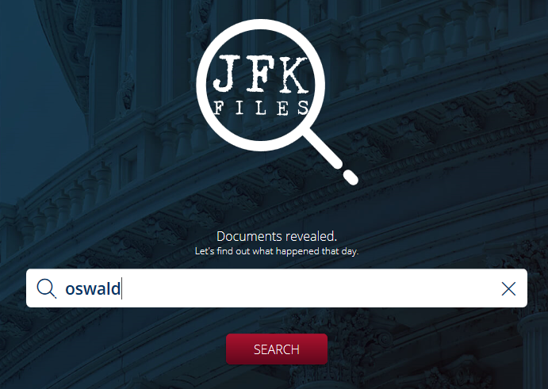

you can learn more about the JFK files demo with the following links:

  - [Experience the JFK Files](https://jfk-demo.azurewebsites.net/)
  - [JFK Files Source code on GitHub](https://github.com/Microsoft/AzureSearch_JFK_Files)
  - [Video presentation on the JFK Files](https://channel9.msdn.com/Shows/AI-Show/Using-Cognitive-Search-to-Understand-the-JFK-Documents)

Using the same database as the JFK Files, the Hoover Bot lets you ask a bot based on former FBI director J. Edgar Hoover about the JFK assassination, either by typing or by speaking. 

When speech is enabled, the bot responds using a simulation of Hoover's voice.

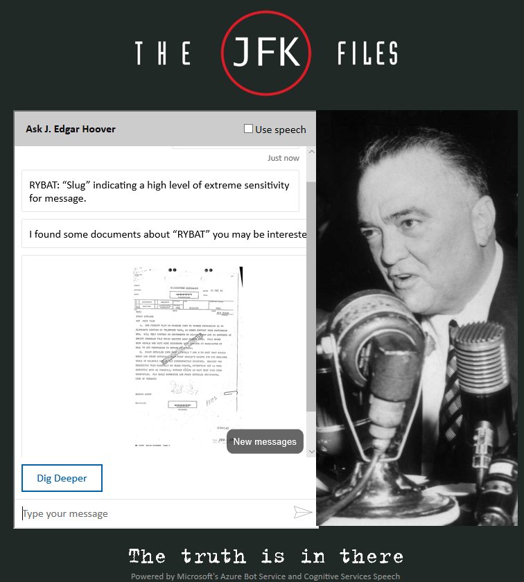

## Azure Architecture

The Hoover Bot uses four of Microsoft's Azure Cognitive Services.

- [Azure Search](https://azure.microsoft.com/en-us/services/search/) is the database back-end that powers the JFK Files. The Hoover Bot sends search queries to it and displays the results.
- [Azure Bot Service](https://azure.microsoft.com/en-us/services/bot-service/) provides the chat-room-like conversational framework. The bot runs in the Azure cloud.
- [Text Analytics](https://azure.microsoft.com/en-us/services/cognitive-services/text-analytics/) is used to extract search keywords from questions entered by users.
- [Speech Services](https://azure.microsoft.com/en-us/services/cognitive-services/speech-services/) provide customized speech recognition and synthesis. Speech operations are performed on the client side, in the browser.

## In this workshop

In this workshop, you will build your own version of the Hoover bot. we will walk through deploying the Bot, Text Analytics and the steps needed to incorporate speech recognition and synthesis. We will first use the default voice and language model, and then build and use a custom voice and model.

The Azure Search instance and the custom speech and voice models take a long time to build, since they are crunching a lot of data, so we have set up these services in advance. All participants will use the same Azure Search and Speech Service instances.

This workshop is based on the JFK Hoover Bot tutorial available at:
[https://github.com/Azure-Samples/jfkfileshooverbot](https://github.com/Azure-Samples/jfkfileshooverbot)

## Prerequisites

See parent [README](../README.md).

You will also need an instance of the JFK Files website and Azure Search instance. For reference you can find it [here](https://github.com/Microsoft/AzureSearch_JFK_Files). We have set up an instance of the JFK Files for you to use, so you won’t need to follow the setup instructions in this repository.

# Tutorial Steps

## Creating the bot

To create the bot, you first create a Bot Service resource in your Azure dashboard. In this process, you’re asked to choose a template. The Bot Service creates a Visual Studio project for you based on this template, which you can download and modify, then re-deploy to the Azure cloud.

The Hoover bot is based on the `EchoBot` template. The EchoBot simply echoes back whatever you type, along with a turn counter. We'll use only the skeleton of this bot; the guts will be replaced with code for cryptonym identification and document search. We'll add a customized Web app that includes our own CSS styles and images. Finally, we'll add speech and voice capability, first with the standard voice and language models, then with custom ones tailored to the app.


1. [Create a resource group for your services](https://ms.portal.azure.com/#create/Microsoft.ResourceGroup)

1. [Deploy the text analytics service](https://ms.portal.azure.com/#create/Microsoft.CognitiveServicesTextAnalytics). 

    The bot uses the Text Analytics service to extract keywords from user queries. Let’s create this resource first. Click **+ Create a Resource** in the sidebar, then search for "Text Analytics." For this tutorial you can use the free pricing tier

    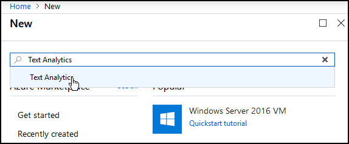

    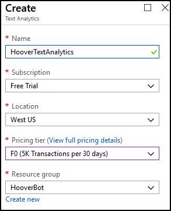

1. Once the service has completed deploying, find the access key by clicking on the **Keys** option in the left frame. Copy this key into the corresponding spot in `JFKHooverBotTemplate.txt`. You will need it later. Also make a note of the region you choose.

1. [Create a Web App Bot](https://ms.portal.azure.com/#create/Microsoft.BotServiceSdkGalleryPackage)

    In the Azure portal click **+ Create a Resource** in the sidebar, then choosing "Web App Bot" under **AI + Machine Learning**. You can also search for "Web App Bot."

    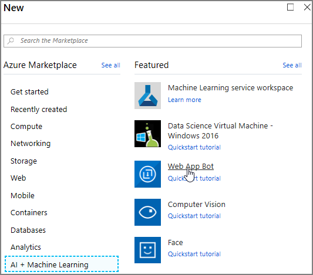

    This style of bot includes a Web hosting component, which we'll use to host the Web page containing a chat interface to the bot. The free pricing tier is suitable for developing the bot. Choose **EchoBot (C#)** as the template.

    Your bot will be hosted on a subdomain of azurewebsites.net. Therefore, its name must be unique among all Azure Web sites. Try hooverbot-abc where abc are your initials, or variations on this theme. Valid characters are letters (not case sensitive, numbers, and hyphens.

    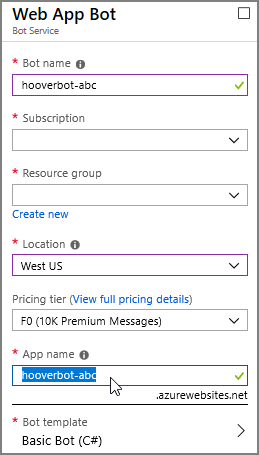

1. Download the source code

    Download the source code for the bot from the Build blade of the new Web App Bot resource. We will use this Visual Studio solution template to customize with our own code and resources. 

    We could start a project from scratch, but it's easier to start with one created by the Bot Service, since it already includes the information needed to publish and run the bot in the Azure cloud.

    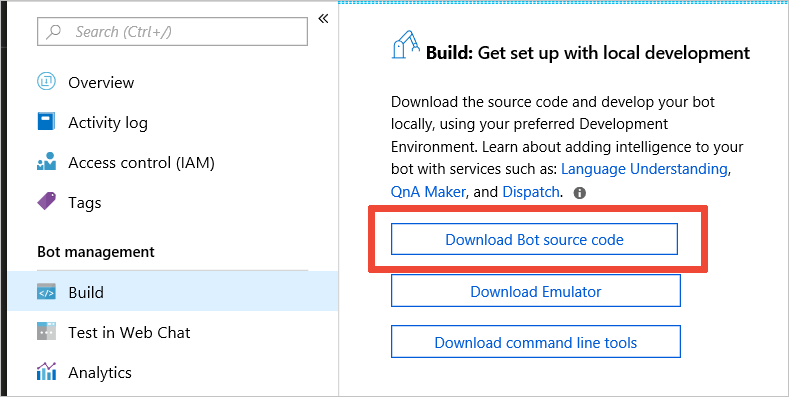

1. Unpack the downloaded files by right clicking the .zip archive and choosing **Extract All** from the context menu.

1. Open the extracted solution folder and double-click the `EchoBotWithCounter.sln` file to launch Visual Studio and open the project.

1. Using NuGet (**Tools > NuGet Package Manager**), check the **include prerelease** option and add the following libraries:

    - `Microsoft.Azure.Search.Data`: the Azure Search client.
    
    - `Microsoft.Azure.CognitiveServices.Language.TextAnalytics`: the Text Analytics client 

   - `Microsoft.AdaptiveCards`: flexible cards for bot responses.

   - `Newtonsoft.Json`: a parser for JSON files.

      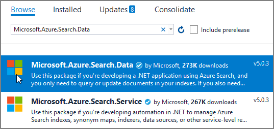

1. Copy the files from the `bot1` folder of this repository to the top level of the Visual Studio project folder. Some of the files have the same names as files already in the project. Allow the files being copied to replace the existing ones. 

    These files include the basic functionality of the bot but without speech capabilities. These files are described in the next section.

1. Open `appsettings.json` in the `wwwroot` folder and enter the required values.

    - **botFilePath** and **botFileSecret** can be found in the Application Settings blade of your Web App Bot (scroll down to the Application Settings heading). Copy these values into the `JFKHooverBotTemplate.txt` file for later use.

      

    - We will give you the searchName and searchKey for the shared JFK Files search service. 

    - The **searchIndex** name should already be **jfkindex**. Do not change it.

    - We will give you the **SearchUrl** for our JFK Files instance.
  
   - Copy the text analytics key you created earlier into the **textAnalyticsKey** variable. 

    - Make sure the **textAnalyticsEndpoint** is for the same region where you deployed your text analytics service. 


1. Copy the files from the provided `wwwroot1` folder of this repository into the `wwwroot` folder in the visual studio project. These files contain the bot's user interface and client-side logic. Again, allow same-named files to replace existing files.

1. Make sure the project builds and runs. With the project running, try your bot in the emulator. Open the Bot Emulator, click **Open Bot** and navigate to your solution's `.bot` file. You will need to enter the bot file secret you copied earlier.

    >**NOTE**: The .bot file is encrypted. The first time you open your bot in the Emulator, you'll be prompted for your bot file secret; it's the same secret you pasted into `appsettings.json`.

    >**NOTE**: Running the project also opens the Web Chat app in a browser. This app connects to a version of the bot running in the Azure cloud. It won't work until you publish the bot. For now, use the emulator to test the unpublished version of your bot. There are a few more things to do before the bot is ready to be hosted in the cloud.

    >**NOTE**: Clean & Re-build your solution after copying in new files to make sure they are included

    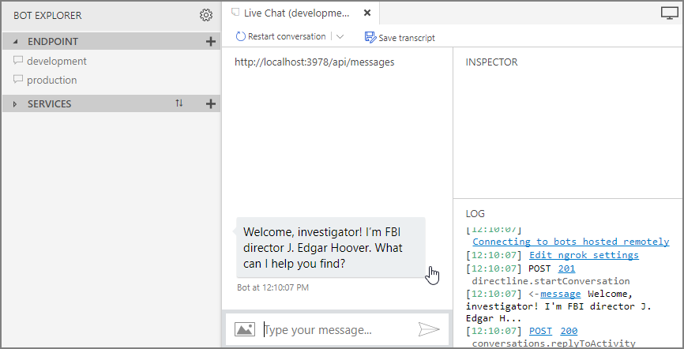

    

## Looking at the code

  Let’s take a quick look at the C# code that powers the bot. This is the code that runs in the Azure cloud and contains all our bot’s conversational logic. You’ll find it in the class `EchoWithCounterBot` in the file `EchoWithCounterBot.cs`. 


  The Bot Service creates a new instance of `EchoWithCounterBot` for each “turn” in the conversation. (The Bot Service has features for maintaining the state of a conversation from turn to turn, but we don’t use any of these in the Hoover Bot.) The instance’s OnTurnAsync method is then called to handle the message sent by the user. The Hoover Bot handles the following.


  - Social niceties such as greetings. There are some static values defined early in the class that you can change to customize the bot’s response to these greetings.

    The method `HandleSocialNiceties()` handles this task. The user’s input is examined for key words like “welcome” and “thank” and an appropriate response is sent for each. If a response was sent, the method returns true so that the top-level method can exit immediately.

  - Cryptonyms (code names) like RYBAT and GPFLOOR and send their definition. We provide a JSON file containing all of these. Recognized cryptonyms also become part of the search query.

    The method `ExtractAndDefineCryptonyms()` handles this task. Each word of the user’s input is examined to see whether it’s in the cryptonym hash map. If it is, its definition is sent to the user. The cryptonyms also become part of the search terms set.

  - Keywords from a user’s question (“Who was in Kennedy’s limousine” becomes “Kennedy limousine”), which are used to perform a full-text search of the JFK Files data set, then display the results to the user. Natural-language questions have a lot of words that are not relevant to a query but are merely part of the question format. Our goal is to generate a good set of keywords that can be used to search the documents in the JFK Files.

  - The method `ExtractKeywords()` builds a search term set using the Text Analytics service. Both Key Phrases and Entities are extracted. With a few exceptions, each word of the extracted key phrases is added to the search terms. Entities are used to find additional important search words. A word like “JFK” will be detected as the entity “John F. Kennedy” but the user’s actual text, “JFK,” is added to the search terms.

  - The `PerformSearch()` method is used to perform the search, and `BuildResultsReply()` builds a reply containing a “carousel” of cards, each with a thumbnail and text excerpt of one document. 
    
  - Methods `DescribeResultsReply()` and `AddDigDeeperButton()` are used to help build the reply.

## Hooking up Web Chat

Azure Bot Service's Web Chat is a JavaScript component that lets you embed your bot in any Web site. We'll use it in the J. Edgar Hoover Bot Web page.

To get Web Chat to talk to your bot, you must enable the bot's Direct Line channel and provide an authentication token in the `settings.js` file in the `wwwroot` folder.

1. In the Azure portal, enable Direct Line in your Web App Bot's Channels blade.

    >**NOTE**: There's already a Web Chat channel in the Channels blade, which you might think is the one you want. This refers to the v3 Web Chat feature. We're using the v4 Web Chat, which uses the Direct Line protocol.

1. Click the globe icon to add this channel

    

1. Click Add New Site

    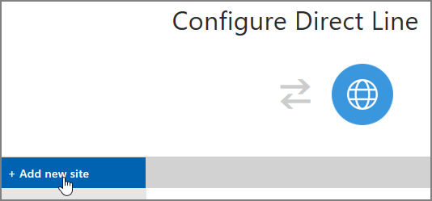

1. Enter "Direct Line" as the name of the new site. Copy the first access key it into the corresponding place in `JFKHooverBotTemplate.txt`. You will need this key later.

    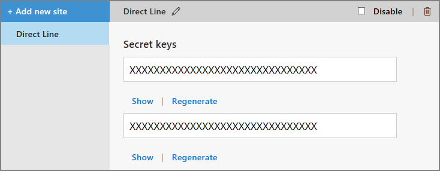

1. Also copy the key into the `botSecret` variable at the top of `settings.js` within the `wwwroot` folder.

1. Save `settings.js`

    > **NOTE**: For more help, see [Connect a bot to Direct Line](https://docs.microsoft.com/en-us/azure/bot-service/bot-service-channel-connect-directline?view=azure-bot-service-3.0)

1. After you've added the Direct Line secret to `settings.js`, publish the bot so you can try it in a browser. 

1. Clean & re rebuild your solution in the **Build** option in the top frame.

## Publishing the Bot
Publish the bot to the Azure cloud by following these steps.

1.	Open the file `[botname].PublishSettings` in your Visual Studio project's PostDeployScripts folder. For example, if your bot's Azure name is **hooverbot-abc**, the file is named `hooverbot-abc.PublishSettings`.

1.	Find the password (value of **userPWD** field) in this file and copy it into the corresponding place in `JFKHooverBotTemplate.txt`

1.	Right-click the project in the Solution Explorer and choose **Publish** to open the Publish page.

    

    
1.	On the Publish page, click **Publish**.

    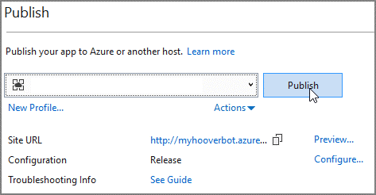

1.	When you're asked for the password, paste the userPWD you copied earlier and click **OK**.

    After your code has been published, the Hoover Bot's Web site opens in your browser. It may take a moment for the site to "warm up" after being restarted as part of deployment. 

1. After the bot welcomes you as a “fellow investigator,” try it out! A couple of sample queries:
    - What was Oswald’s connection to Cuba?
    - What does RYBAT mean?

1. To make publishing easier the next time, save your deployment password. Back in Visual Studio, right-click on the project,  click **Publish**. Then click **Configure** in the Publish page and paste the password in the appropriate field. Click Save.


## Adding voice input and output

It is straightforward to add speech recognition and voice response, thanks to Web Chat's integration with the Azure Speech Service. We’ll do it in two stages.
  - First, we’ll add basic speech input and output using the default model and voice.

  - Second, we’ll add a custom language model and a custom voice to better suit our bot’s needs.

A custom language model helps assure that the bot recognizes the cryptonyms (code names) used for certain persons, programs, and events. A custom voice allows the bot to respond using a facsimile of J. Edgar Hoover's voice.

>**There’s a wrinkle**:  Web Chat’s speech integration does not yet support custom speech and language models. To mitigate this we’ll use the Speech Service JavaScript SDK directly for speech recognition and use its REST interface for speech synthesis.

## Basic Speech Support

We need to make a few changes to the server-side code to send the text to be spoken along with each response. In some cases, the spoken text will be slightly different from the text displayed in the chat window. This is done by setting the Speak attribute on the reply message sent to the client. 

Let's first discuss the changes which need to be made.

The changes in `EchoWithCounterBot.cs` are simple:
  - We add a method `SendSpeechReply()` as a complement to `SendTextOnlyReply()`. This new convenience method is used to send replies with their Speak attribute set. The caller can optionally pass a second string representing the speech to be produced if it’s different from the display text.  We change several calls to use `SendSpeechReply()`.

  - The search reply doesn’t use the convenience method, so we update it to set the reply’s Speak attribute.

The browser JavaScript needs the following changes, also relatively minor, to enable speech functionality.


  - Wrap the body of the JavaScript in an async function, so we can use the await keyword.
  - Add a call to `WebChat.createCognitiveServicesSpeechServicesPonyfillFactory()` to enable the Speech Services support. (We have hard-coded the region here as westus.) 

    ```javascript
      const webSpeechPonyfillFactory = await window.WebChat.createCognitiveServicesSpeechServicesPonyfillFactory({
          region: 'westus',
          subscriptionKey: speechKey
      });
    ```

  - The resulting ponyfill object, which is a generic interface to the Web speech APIs, is then passed to `WebChat.renderWebChat()` when initializing the chat client.

    ```javascript
    const chat = window.WebChat.renderWebChat({
                    bot: bot,
                    directLine: connection,
                    user: user,
                    sendTimeout: 60000, // ms
                    webSpeechPonyfillFactory
                }, webchat);
    ```

  - `settings.js` in the `wwwroot` folder needs a Speech Service subscription key. 

  ### Update your Bot

  1. Deploy a speech service [here](https://ms.portal.azure.com/#create/Microsoft.CognitiveServicesSpeechServices). Once it has deployed, copy the key into the appropriate spot in `JFKHooverBotTemplate.txt`. You can ignore the other fields (speechRecognitionEndpoint, speechSynthesisEndpoint ) in the template file. These are needed for the custom model.

  1. Copy the updated `EchoWithCounterBot.cs` file from the `bot2` folder to the top-level folder of the Visual Studio project, replacing the existing file. 
  
  1. Similarly, copy the `bot.htm` file from `wwwroot2` into the project’s `wwwroot` folder.

  1. Open `wwwroot/settings.js` and add the speech key & make sure `speechRegion` matches the region you chose when you deployed the speech service. Ignore the `speechRecognitionEndpoint`, `speechSynthesisEndpoint` and `tokenEndpoint` fields for now. 
  
  1. Clean, re-build and deploy the bot as before
  
  1. Try out the speech feature in the browser by clicking the microphone icon. You can speak a question such as “What is RYBAT?” and the response will be spoken.
  
      But… there is an immediately obvious problem with our example. Our bot doesn’t recognize RYBAT as a word, instead recognizing it as “rye bat” or something similar (“ripe hat,” maybe). 
  
     How can we fix that?

## Customizing Speech Recognition

The JFK assassination documents include several terms not found in everyday English. Chief among these are the cryptonyms (code names) representing various persons, operations, locations, events, and even categories of secrecy. The cryptonym for Lee Harvey Oswald, for example, is GPLOOR. It's important that when the user speaks "g p floor" that it's recognized as the cryptonym GPFLOOR so that it can be successfully used in a query. Try it now and you’ll notice that it recognizes it as “g p floor.”

We can teach the bot how to recognize these terms by customizing the pronunciation model of the speech-to-text function of the Speech service.

The pronunciation data to be submitted to the Custom Speech portal is a simple UTF-8 or ASCII text file containing the "display form" of the term ("GPFLOOR" in this case), a tab character (code point 9), and the pronunciation of the term (here, "g p floor").

There are hundreds of known CIA cryptonyms. Fortunately, the JFK Files search demo includes a list of them, along with a description of each, in the CryptonymLinker skill for Cognitive Search. 

We have converted this list to the format required by the Custom Speech portal, removed the descriptions, and added the pronunciation of each term. The resulting file is included here as cryptonyms.txt in the speech folder. (Not to be confused with cryptonyms.json in the bot folder, which contains the definitions for use by the bot's backend to send back definitions of cryptonyms.)

Some cryptonyms are regular English words, like ZIPPER. There are still included in the pronunciation data because they should appear in their all-uppercase form when recognized. We've also included "JFK," which is not a cryptonym, but should be recognized as a single word.

  >**TIP** Pronunciations are given priority based on their order in the pronunciation file. To prevent shorter cryptonyms from being recognized prematurely when a cryptonym begins with a prefix that is itself a cryptonym, (e.g. recognizing "GP" instead of "GPFLOOR", then recognizing "floor" separately as a regular English word), sort the pronunciation file in reverse alphabetical order. This way, GPFLOOR comes before GP, and has priority over GP in recognition.


  >**TIP** Searching the JFK Files for "JFK" is not actually very useful, because nearly every document in the collection, even those related to other individuals, includes a cover page indicating that the document is part of the "JFK Assassination System." In many documents, a notice containing "JFK" appears on every page.

Creating a custom language model using the cryptonym pronunciation data also requires language data; you can't train a language model without both files. The language file contains phrases or sentences that are likely to be uttered by a user. The language data is treated as an addition to a base model, so it needn't be extensive. We have provided a file, `questions.txt`, consisting of a handful of sample questions that users might ask the Hoover Bot.

With these two files, you are ready to adapt Speech Recognition to the needs of the Hoover Bot. 

> **NOTE: This process can take a while to complete. For the lab we will be providing keys to a model which has already been trained and deployed**

 You can walk you through the process below for later use and to understand the steps.

1.	Log in to the Custom Voice and Speech portal, [cris.ai](http://cris.ai/), with the same Microsoft account you use for your Azure subscriptions.

    The first time you log in, you'll be asked to associate your Custom Voice and Speech account with a Speech Service subscription. Use the speech service key from you the Speech service you deployed earlier.

    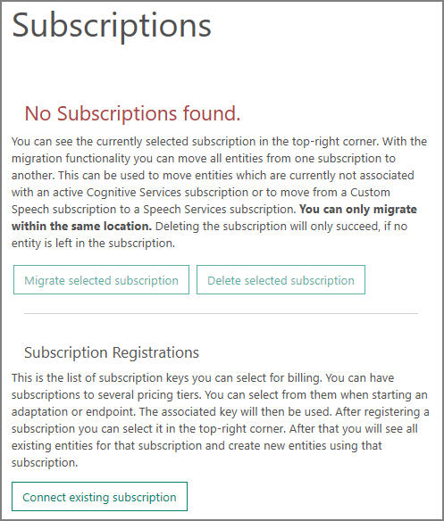

1.	Click **Connect existing subscription**, then enter either of the subscription keys for your Speech Service subscription and click **Add**.

1. Click **Custom Speech -> Adaptation Data** in the upper left tabs

    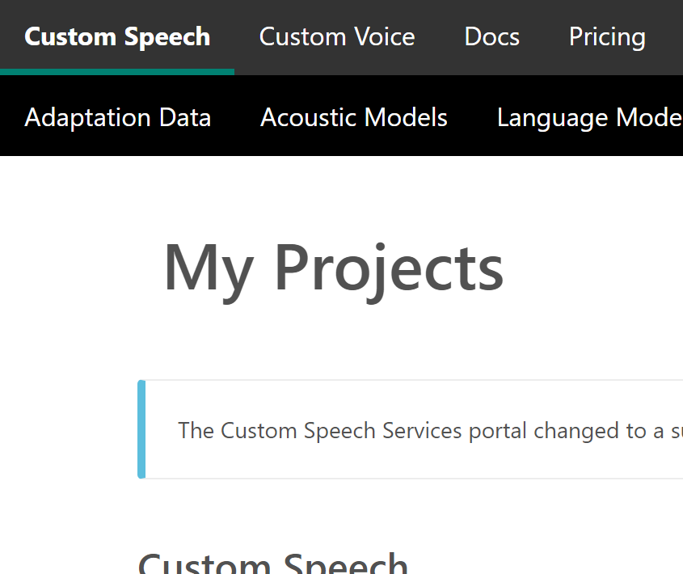

1.	Upload `questions.txt` in the `speech` folder as a language data set to **Custom Speech > Adaptation Data**. 

    First, click **Import** next to Language Data Sets, fill out the form, and attach questions.txt. Click **Import** to proceed.

    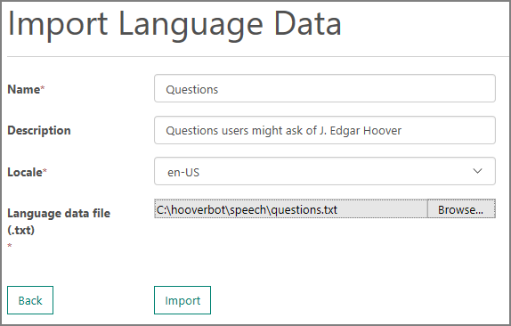

1. Click **Import** next to Pronunciation Data Sets, fill out the form, and attach the `cryptonyms.txt` file in the `speech` folder. Again click **Import** to proceed.

    It takes a moment to process the new data sets. Wait until both data sets have a status of Succeeded before continuing.

    

1. Switch to the Language Models page and click **Create New** to use these data sets to train the speech recognizer.

    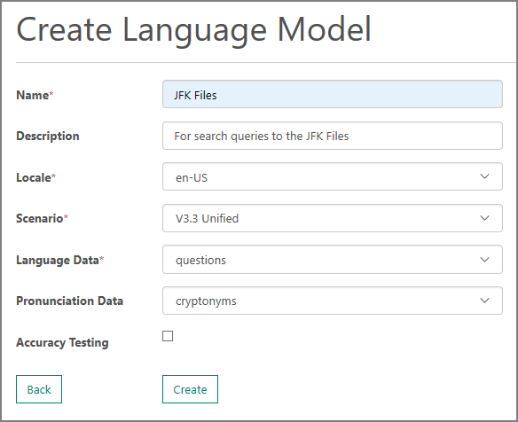

1.	Fill out the form as shown, choose the language and pronunciation data sets you just uploaded, and click **Create**.

1.	Create an endpoint to be used with the custom speech model by clicking **Create New** on the Endpoints page. Make sure your new Language model shows up under the **Language Model** section.

    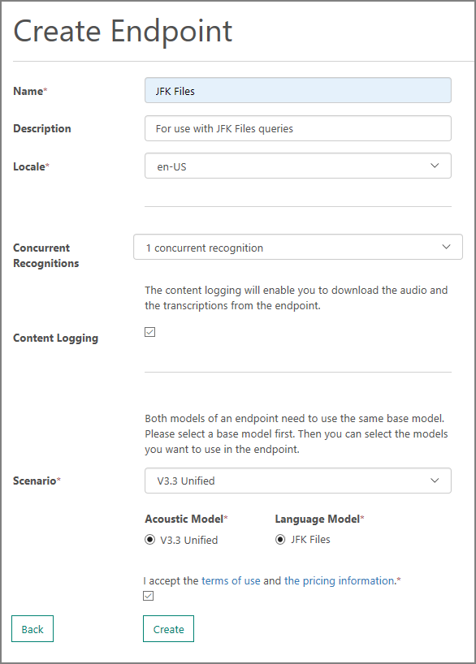

1. Once more, fill out the form, choose the v3.3 Unified acoustic model and the language model you just created, and click **Create**.

    It may take a few moments to deploy the endpoint. When the endpoint's Status on the Endpoints page is Succeeded, click its Details button and scroll down to the Endpoints table to find the `WebSockets (wss://)` URL you need. You want the second one listed, the one thot supports up to 10 minutes of dictation but not punctuation.

For full details on the uploading and training process, see [Enable custom pronunciation](https://docs.microsoft.com/azure/cognitive-services/speech-service/how-to-customize-pronunciation), Create a [custom language model](https://docs.microsoft.com/azure/cognitive-services/speech-service/how-to-customize-language-model) and [Create a custom speech-to-text endpoint](https://docs.microsoft.com/azure/cognitive-services/speech-service/how-to-create-custom-endpoint).


## Customizing Speech Synthesis

While we’re customizing things, let’s make our bot's voice sound like J. Edgar Hoover. We need recordings of his voice, along with a text transcript of each recording. We located a 21-minute minute recording of a November 1963 phone call between Hoover and President Lyndon B. Johnson. From this audio, we extracted nearly 200 utterances, edited them slightly to remove "disfluencies" like repetitions and filler such as "ah" and "um," and transcribed them into text.


The quality of the recording isn't ideal. It's a telephone call to begin with, and the recording is old and contains a lot of static. We can't use any audio where Johnson and Hoover are speaking at the same time, which happens frequently. It would be better, as well, if we had a lot more utterances. Still, even with just a couple hundred utterances, the synthesized voice is recognizably Hoover's. There are other recorded phone conversations between Johnson and Hoover that could provide further utterances if you want to improve the voice's quality.


  >**TIP** We used the free [Audacity](https://www.audacityteam.org/) audio editor to prepare the audio samples. Audacity lets you "tag" segments of audio within the file, then export the tagged sections using the tag names as filenames. If you want to add more utterances, you'll find Audacity up to the task.

After extracting the utterances, we created a ZIP archive containing a numbered audio file for each utterance, along with a text file that holds the number of the file, a tab (code point 9), and the text of the utterance. The text has been normalized, spelling out numbers and abbreviations. And now we pass this data on to you.

Again, training can take a long time, so as with the custom language model, we’ve already done it for you. But here’s how you do it:


1.	Log in to the Custom Voice and Speech portal, [cris.ai](http://cris.ai/), with the same Microsoft account you use for your Azure subscriptions.

1.	Go to **Custom Voice > Data** and click **Import Data**. fill in the Import Voice data form and choose the transcript file, `transcript.txt` and voice files, `audio.zip`. Both of these files are in `JFK-Example/voice` in this repo. Click **Import**.

    


1.	Wait until the Status column in the My Voice Data page reads "Succeeded."

1.	Switch to the Models page and click **Create New** to use this data set to train the custom voice. Choose the data set you just uploaded and fill in the rest of the requested information, then click **Create**.

    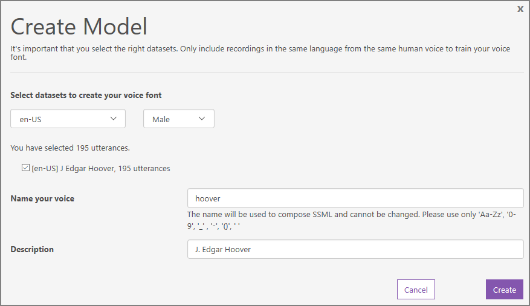

    Creating a custom voice model can take a significant amount of time, so perhaps let it run overnight. You can train a custom speech model at the same time (see next section).

1. After the new custom voice has been created, click **Deploy** next to the new voice in the Models page to create a new endpoint.

    Enter the name and description as requested, then click **Create**. It takes a moment to create the new endpoint. You'll find the URL next to the endpoint on the Endpoints page. Copy the endpoint into the corresponding spot in `JFKHooverBotTemplate.txt`. You will need it in the Hoover bot Web app.

    For full details on the uploading and training process, see [Creating custom voice fonts](https://docs.microsoft.com/azure/cognitive-services/speech-service/how-to-customize-voice-font).  
  
    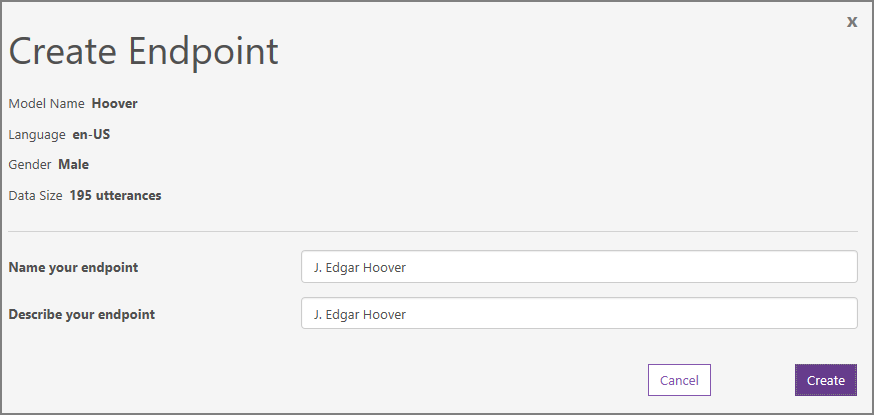

## Enabling custom speech in the Web app

As we noted earlier, we need to write our own code to integrate the Web Chat with our custom speech and voice services, since Web Chat currently does not support customized models and voices. Most of this is in `bot.htm`. The code is rather extensive, so we won’t show all of it here. Let's review the changes we need to make and then walk through the steps.

  - We hook into Web Chat’s underlying Direct Line protocol and subscribe to message events containing a speak attribute, and call our function `speak()` when one arrives. This function does a REST request to the Speech Service’s custom text-to-speech endpoint, receives the audio, and creates an HTML 5 audio player element to play it. To prevent two pieces of speech from overlapping, we use a queue (and a separate queue for the network requests). The audio may be cached and reused.

  - The **Use speech** checkbox is hooked up to another event handler that enables continuous speech recognition using the Speech Service JavaScript SDK. When speech is detected, it is sent to the bot using the Direct Line protocol. It appears in the Web Chat window a moment later. The Speech Service automatically stops recognizing speech after 20 seconds pass without any recognizable speech.

  - There’s also a minor change to the server-side code to add cache hints to the bot’s responses. This allows the client code to retain and reuse the audio files containing the synthesized speech if they will be used frequently. This saves bandwidth and, in a production application, money. We did this by writing another helper method, `SendCacheableSpeechReply()`, which we call when appropriate in place of `SendSpeechReply()`.

    ```javascript
    // Send a reply with a speak attribute so it will be spoken by the client
    // Also include a value attribute indicating that the speech may be cached
    private async void SendCacheableSpeechReply(string text, string speech = null)
    {
        var reply = activity.CreateReply();
        reply.Text = text;
        reply.Properties["cache-speech"] = true;
        reply.Speak = speech == null ? text : speech;
        context.SendActivityAsync(reply);
    }

    ```

    We’ve made a couple of changes to the bot’s user interface. Since our speech functionality is not part of Web Chat, we have added a Use Speech checkbox at the top of the chat window to take the place of the microphone icon used in the standard Web Chat.
 
      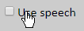

    A voice greeting is heard when this checkbox is enabled for the first time in a session.

The other change is that we now require all spoken questions to begin with “Mr. Hoover.” This way, we can be sure the question is being addressed to our bot and avoid responding to other speech in the vicinity.

### To add the new code:

1.	Update the code as before, copying the files from `bot3` into the top level of the Visual Studio project and the files from `wwwroot3` into the `wwwroot` folder of the Visual Studio project.

1.	Open the `wwwroot\settings.js` file and add the custom Speech and Voice endpoints where indicated. You will find all the necessary keys in the `JFKHooverBotTemplate.txt` file.

    >**NOTE**: If you switched to the provided custom speech endpoints, make sure to update the `speechRegion` and `speechKey` variables to match the new service.

1.	Build and publish the bot as before. The bot's Web Chat opens in a browser. It takes a moment for the bot to "warm up" after the service is restarted, so wait patiently until the bot displays its greeting.

With the bot open in the browser, you can activate the "Use speech" checkbox. After Hoover's voice greets you, you can ask him questions by addressing him as "Mr. Hoover," for example, "Mr. Hoover, what does GPFLOOR mean?"

The bot's speech recognition is temporarily disabled while the bot is speaking.

## Learn More
You can find more details about this final version of the code in the README file in the sample repository at [https://github.com/Azure-Samples/jfkfileshooverbot](https://github.com/Azure-Samples/jfkfileshooverbot).
