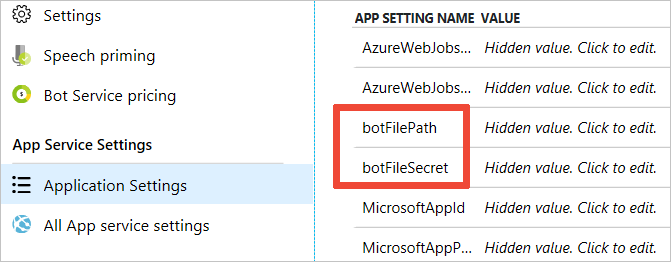
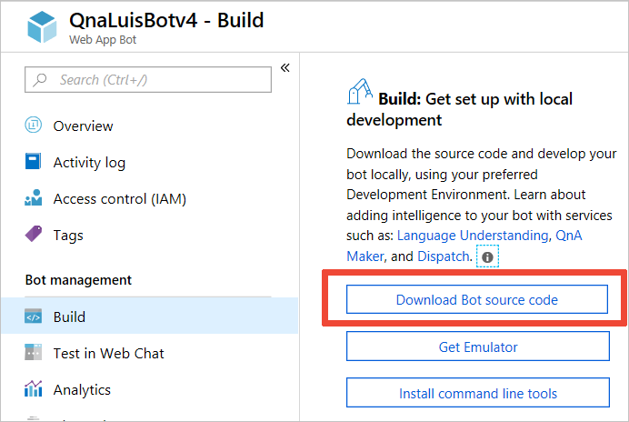
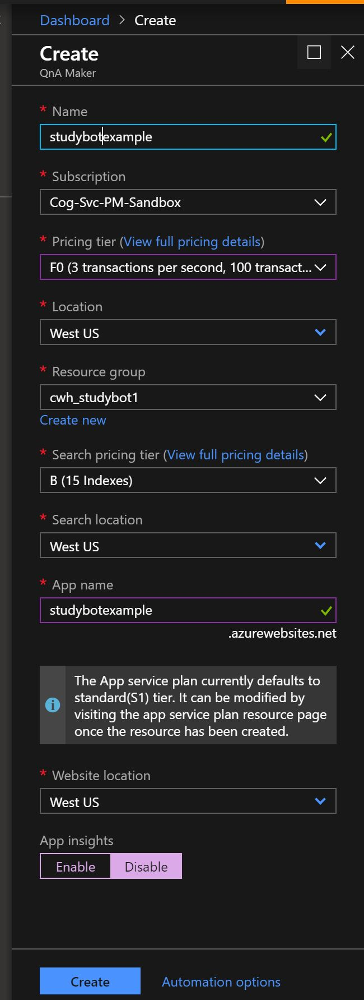
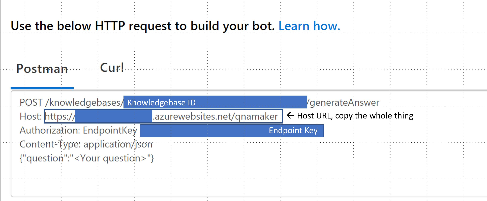

# Create your Bot

In this section you will create the bot used for the Study Bot application using the [Microsoft Bot Framework](https://dev.botframework.com). We will also highlight how to hanlde multiple knowledge bases by using [Dispatch](https://docs.microsoft.com/en-us/azure/bot-service/bot-builder-tutorial-dispatch?view=azure-bot-service-4.0&tabs=csharp) to "dispatch" user queries in a chat client to the right Microsoft Cognitive Service. Dispatch will direct the user to [LUIS](https://luis.ai), which then directs the user to the right QnA Maker knowledge bases stored in [qnamaker.ai](https://www.qnamaker.ai/). 

The  QnA Maker [Chitchat](https://docs.microsoft.com/en-us/azure/cognitive-services/qnamaker/how-to/chit-chat-knowledge-base) feature is used as one of the knowledge bases and is integrated into LUIS using the CLI Dispatch tool. Chitchat gives the chat client a more natural, conversational feel when a user chats off-topic, asking questions such as "How are you?", "You're boring", or "Can we be friends?". There are three different personalities you can set Chitchat to when creating it in [qnamaker.ai](https://www.qnamaker.ai/): The Professional, The Friend, or The Comic. This sample uses The Comic setting, since the Study Bot targets high school students.

[Bing spell check](https://docs.microsoft.com/en-us/azure/cognitive-services/luis/luis-tutorial-bing-spellcheck) was added to the bot to correct light misspellings.


## Create a C# Web App Bot

1. [Create a Basic C# web app bot](https://docs.microsoft.com/en-us/azure/bot-service/bot-service-quickstart?view=azure-bot-service-4.0) in the [Azure Portal](https://ms.portal.azure.com). 

1. Find the botFilePath and botFileSecret by going to the Application Settings menu in the Web App Bot you just deployed. Copy these values into the `StudyBotTemplate.txt` file. You will need these values later

    

1. After your bot deployes, download your bot code locally. To do this go to the Build section of the Bot management menu.

    

1. Extract all the files and open the solution file in Visual Studio.


1. Update the `appsettings.json` file in the root of the bot project with the botFilePath and botFileSecret. 

   The update should look something like this, replacing `<TEXT>` with your unique values: 
    ```json
    {
      "botFileSecret": "<YOUR BOT SECRET>",
      "botFilePath": "./<YOUR BOT NAME>.bot"
    }
    ```

1. At this point, you can try to test your bot. See 'Run and Test your Bot' below

1. Copy in the Study bot code. 

    Copy the files in this folder (Qna-luis-bot-v4) into the top level folder of the solution you just downloaded. Replace any files that already exist.
    
## Creating the Cognitive Services: QnA Maker and LUIS

### QnA Maker

1. Deploy a QnA Maker Service in [qnamaker.ai](https://www.qnamaker.ai). When you deploy your QnA Maker service, be sure to choose a 'B' search tier or higher since we will deploy more than 3 search indexes. [Additional Documentation](https://docs.microsoft.com/en-us/azure/cognitive-services/qnamaker/quickstarts/create-publish-knowledge-base)

    

1. After the QnA Maker service has been deployed, copy the key into the QnA Maker key section in the `StudyBotTemplate.txt` file. Also note the `region` you chose in the file. You will need these values later

1. For this tutorial you will need to deploy 4 knowledge bases. For each knowledge base you will need to complete the following steps:

    1. Choose "Create a knowledge base" in qnamaker.ai
    1. Choose the QnA Service you just deployed
    1. Name the knowledge base according to the table below
    1. Upload the file according to th table below
    1. Click "Create your KB"
    1. You might want to add alternative keywords to your knowledge base questions in qnamaker.ai in addition to the ones already there. To add them to your knowledge bases, go to "My knowledge bases" in [qnamaker.ai](https://www.qnamaker.ai) and in each knowledge base click the "+" sign near each question (after your knowledge bases have been created). Type in the alternative question (term). This is only needed for the Biology, Geology, and Sociology KBs.

        
    1. Click "Save and Train" in the top right
    1. Click "Publish" in the top right and then publish the knowledge base
    1. Copy the knowledgebase ID into the template into the `StudyBotTemplate.txt` file, you will need it later. You can find the ID by looking at the URL in the sample postman code -- see pic below
        * Also copy the host url & authorization endpoint key into the template file. These will be the same for all 4 knowledge bases
    
    Knowledge Base | File
    ------------ | -------------
    StudyBiology | StudyBiology.tsv
    StudySociology | StudySociology.tsv
    StudyGeology | StudyGeology.tsv
    Chitchat | don't upload a file, choose the comic chithcat option
    


    

 
### LUIS

After you have created your web app bot (above), you will see a LUIS app has been auto-created for you in [luis.ai](https://www.luis.ai). We won't actually use this app, we'll replace it with our Dispatch app later in this tutorial. This app will be created through Dispatch commands.

Find the LUIS authoring key in the "Setttings" menu on the drop down menu when you click on your account name in the upper right corner on luis.ai. Copy this key into the `StudyBotTemplate.txt` file. You will need this key later in the tutorial.

## Adding services to your .bot file & creating Dispatch

### Install BotBuilder Tools

1. Ensure you have [Node.js](https://nodejs.org/) version 8.5 or higher
    ```cmd
        node --version
    ```

1. Install the bot-builder tools. In a command prompt/terminal navigate to your bot project folder and type the command:
    ```cmd
    npm i -g msbot chatdown ludown qnamaker luis-apis botdispatch luisgen
    ```
### Add services to your .bot file
The MSBot tool is a command line tool to create and manage bot resources described via a .bot file. See [here](https://github.com/Microsoft/botbuilder-tools/blob/master/packages/MSBot/docs/bot-file.md) to learn more about the `.bot` file.

1. Connect QnA Services
    
    We need to connect the bot to all of the QnA Knowledge bases (KB) that you just created.  

    For each QnA Maker knowledge base you created, run the following command. You should have copied the info for each parameter into the StudyBotTemplate.txt file earlier

    ```cmd
    msbot connect qna --secret <bot secret>  --name <name of the KB> --kbId <Knowledgebase ID> --subscriptionKey <QnA Maker Service key> --endpointKey <QnA Maker endpoint key> --hostname <hostname url> 
    ```

1. We also want to remove the initial Luis service which was created when you deployed the bot. To do this run the following command:

    ```cmd
    msbot disconnect BasicBotLuisApplication --secret <Bot Secret>
    ```

1. Create the dispatch file

    [Dispatch](https://github.com/Microsoft/botbuilder-tools/tree/master/packages/Dispatch) is a command line tool that will create the Dispatch keys and IDs (.dispatch file), a list of all your LUIS utterances that match your QnA Maker knowledge base questions (.json file), create a new Dispatch app in your LUIS account, and connect all your Cognitive Services to the Dispatch system.

    Create a dispatch app by running the following command:

    ```
    dispatch create --bot <bot file path> --secret <bot secret> --luisAuthoringKey <key> --luisAuthoringRegion westus --culture en-us -n <name> --subscriptionKey <luis authoring key>
    ```

    You can view your new Dispatch app in in the `<DISPATCH-NAME>.dispatch` file that was just created. Also notice the `<YOUR-BOT-NAME>.json` file now contains a very long list of every utterance you have from your LUIS Dispatch app from all its intents.

1. Add the dispatch file & model to your bot

    ```
    msbot connect dispatch --input <name of your dispatch service>.dispatch --secret <bot secret> --subscriptionKey <luis authoring key>
    ```

1. This Dispatch sequence also creates a special LUIS app for the Dispatch service in luis.ai. 

    Go to your account in luis.ai and find the Dispatch app just created. You can see there is a `None` intent (default) and then your knowledge base intents. However, these are not named well, make sure to rename them (click pencil icon near title) to match the naming of the QnA knowledge bases. For instance, the geology KB is named StudyGeology, in luis.ai, qnamaker.ai, and in the .bot file (name field of each object). They all need to match.

1. After renaming your LUIS intents, train and publish them. It might take a minute or two to see the changes reflected in your responses in the chat client.

1. Update the `NlpDispatchBot.cs` file to reference the dispatch service you just created. Update line 29.

    ```cs
    public static readonly string DispatchKey = "<dispatch name chosen above>";
    ```

    Note: if you used different knowledge base names, you will also need to update the references to these knowledge bases in this file. (approx on line 35 & 123)

1. Install the `Microsoft.Bot.Builder.AI.QnA` package.o do this go to **Tools -> NuGet Package Manager -> Manage NuGet Packages for Solution**. 

    >**NOTE:** you may need to install version 4.1.5 instead of the latest

    

#### Enable Bing Spell Check

1. [Deploy](https://ms.portal.azure.com/#create/Microsoft.CognitiveServicesBingSpellCheck-v7) an instance of Bing Spell Check v7 resource in teh Azure portal and copy the key into the `StudyBotTemplate.txt` file.

1. Copy the Bing Search key into line 32 in `Start.cs`. 

    ```cs
    private static string bingSpellCheckKey = "<ADD-YOUR-BING-SPELL-CHECK-KEY-HERE>";
    ```

## Run and test your bot

### Connect to bot using Bot Framework Emulator

1. Build/run your bot project. You'll see a browser window open that confirms success.
1. Launch the Bot Framework Emulator
1. File -> Open bot and navigate to your bot project folder
1. Select `<YOUR-BOT-NAME>.bot` file and it opens in the emulator.
1. When you see `[19:15:57]POST 200 conversations.replyToActivity`, your bot is ready to take input.
1. Type any question of your knowledge bases (from any one) and the answer should be returned. 
1. Note: your project must be running in order to use the emulator.

## Deploy this bot to Azure

### Publish from Visual Studio

1. Open the `.PublishSettings` file you find in the PostDeployScripts folder
1. Copy the `userPWD` value
1. Right-click on your Project of the Solution Explorer in Visual Studio and click the menu item "Publish".
1. Click the "Publish" button when the file opens and then paste the password you just copied into the popup.

## Next steps

Configure the Study App Windows application [here](../StudyBot/README.md).

## Troubleshooting for the Azure Web Chat

Due to the dispatch commands, it's possible after you publish your code back to Azure that testing in Web Chat won't work, even when your bot works well locally. This is likely due to the app password in your bot being encrypted. If this is the case, changing the app password in your production endpoint should fix it. To do this:

1. In Azure, go to the Resource Group of your bot. You can find this by clicking on your web app bot and finding the Resource Group in the Overview menu.
1. After clicking on the Resource Group, click the Deployments section under Settings in your menu. You will see a list of all of those resources' apps.
1. Find your bot in that list, it will have the language of your bot and several characters attached to the end of the title, but your bot's name should be there.
1. Click on that bot name and a panel will open to the right, horizontal scroll to view it.
1. A few lines down you will see `Deployment details(Download)`, click on the download link.
1. Open that downloaded .zip and find the `deployment.json` and open it.
1. On about line 49, you'll see an app password. Copy that value.
1. Go back to your local copy of your bot and open the `.bot` file.
1. Paste the app password over the `appPassword` in your `production` endpoint object.
1. Save and publish back to Azure, then refresh your bot and retest your bot in Web Chat. If this does not resolve the issue, put in a support request in Azure.

