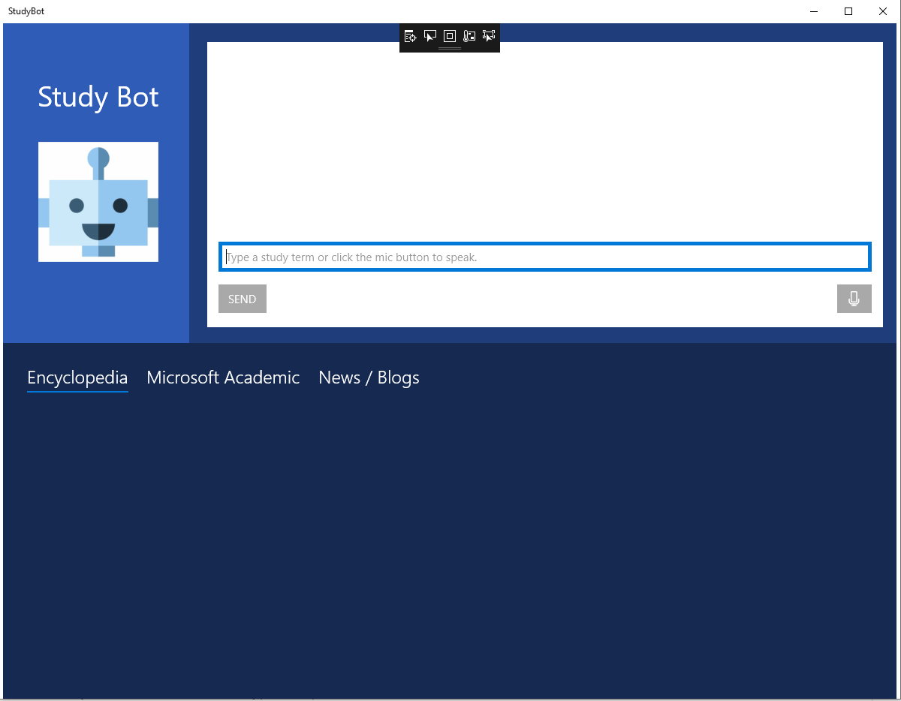
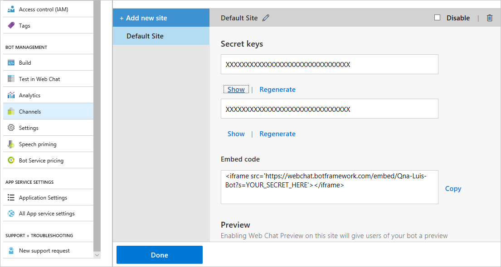
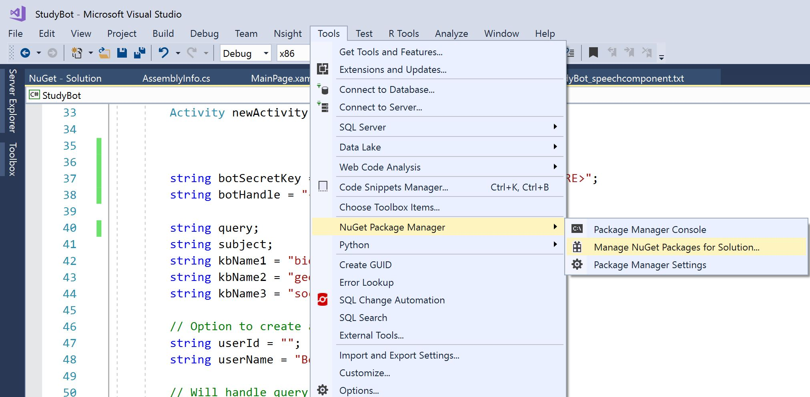
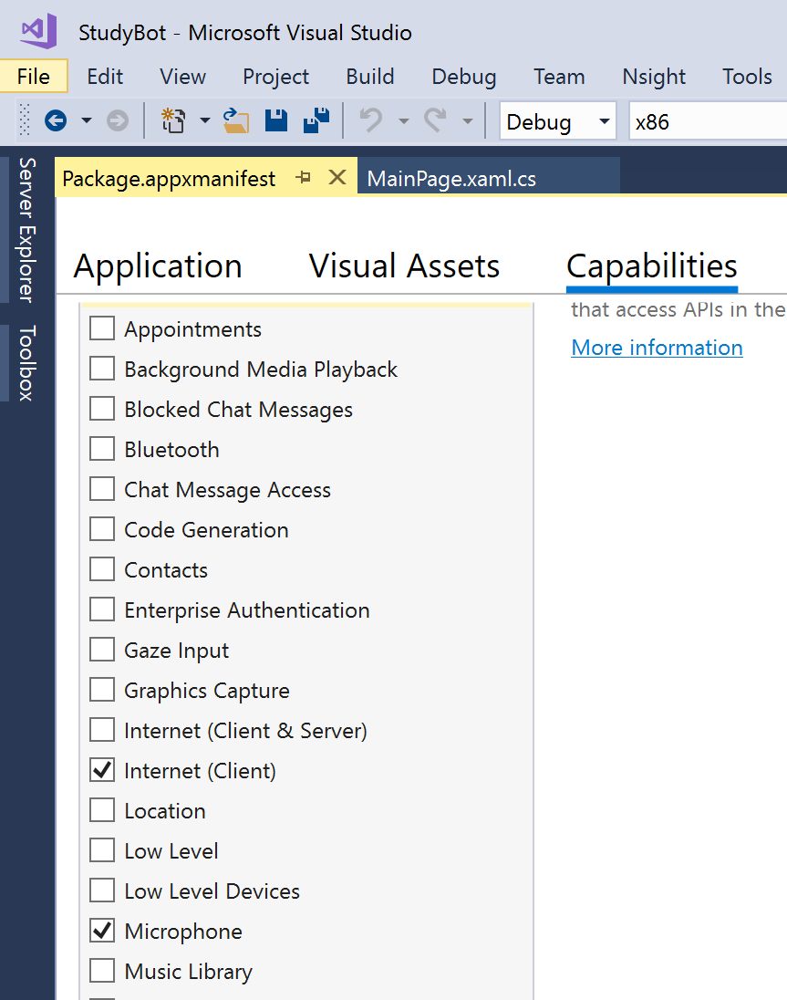

# Create the Study Bot Application

This part of the tutorial will create a UWP which includes an embedded chat linked to an Azure Bot. This application contains a relevant website query based on the chat queries entered by the student, for instance, if the user wants to know the definition of a "virus". 

The queries will then act as search terms for an encyclopedia, Microsoft Academic, and a Bing search engine in their respective `WebViews` in the app.

The steps in this tutorial will walk through how to add a speech input into the chat. We will use [Speech Service](https://docs.microsoft.com/en-us/azure/cognitive-services/speech-service/) for speech to text.



## Prerequisites

Complete the steps for deploying the Study Bot service [here](../Qna-Luis-Bot-v4/README.md). You will need the bot name and secret key from this sample. You should have copied this into the `StudyAppTemplate.txt` file.

## Setup & Run the App
1. After cloning this  repo, open the Study Bot solution file in Visual Studio 2017+.

1. In `MainPage.xaml.cs`, add your Qna-Luis-Bot's bot's name (verbatim) to `botHandle`. For example, Qna-Luis-Bot-v4.

1. Since the Study Bot UWP app is considered an external client that needs to access the bot in Azure, we'll need to connect it to a Channel called [Direct Line](https://docs.microsoft.com/en-us/azure/bot-service/bot-service-channel-connect-directline?view=azure-bot-service-3.0). To do this go to the Channels menu in your web app bot resource in the Azure portal and click the globe icon.

    

1. This initializes the Direct Line channel. A popup appears that has your bot secret key. Copy this into the `StudyBotTemplate.txt` file

    

1. Click "Done" at the bottom. Then you will see Direct Line has been added next to Web Chat.

    

1.  Copy the Direct Line key in the botSecretKey varible at the top of the `MainPage.xaml.cs`.

1. Install the `Microsoft.Bot.Builder.AI` package.o do this go to **Tools -> NuGet Package Manager -> Manage NuGet Packages for Solution**. 

    >**NOTE:** you may need to install version 4.1.5 instead of the latest

    

1. Build and Run the application. Ask the chat 'what is lava?'

## Add speech to the application

This section will walk through the process of adding speech to text capabilities to the C# application. 

1. [Deploy](https://ms.portal.azure.com/#create/Microsoft.CognitiveServicesSpeechServices) the speech service from the Azure portal. After the service has deployed, copy the key into the `StudyBotTemplate.txt` file. 


1. In the Study App solution, you will need to install the speech NuGet package. Follow the same steps as before and search for `Microsoft.CognitiveServices.Speech` in the NuGet Package Manager.

1. Add the Microphone as a capability in the app. Open `Package.appxmanifest` and select **Microphone**

    


1. Add a speech button the App. We will add the microphone icon which will call the 'Button_Mic' method when clicked. 

    In `MainPage.xaml`, add the following code for a button on line 45:

    ```cs
    <Button x:Name="MicButton" Background="DarkGray" BorderBrush="Transparent" BorderThickness="5" Margin="5, 5, 5, 5" Grid.Row="3" HorizontalAlignment="Right" Click="Button_Mic">
                    <SymbolIcon Symbol="Microphone" Foreground="#fff" />
    </Button>
    ```

1. Add code to handle for when the user clicks the Mic Button. Open the `MainPage.xaml.cs` file in the solution.

    1. Add the following using statement at the top of the file:

        ```cs
        using Microsoft.CognitiveServices.Speech;
        ```

    1. Add in your speech service connection information inside the `MainPage` class at line 40 next to the bot credentials:

        ```cs
        string speechSubscription = "<YOUR AZURE SPEECH SERVICE SUBSCRIPTION KEY>";
		string speechRegion = "<YOUR REGION>";
        ```

    1. Update the placeholder text in the chat window. Update the following variable assigment on line 71. 

        ```cs
        NewMessageTextBox.PlaceholderText = "Type a study term or click the mic button to speak.";
        ```

    1. Add code for converting input speech to text. Open the `SpeechCode.cs` file and copy the method to the MainPage class. Ths code is derived from the following [sample](https://docs.microsoft.com/en-us/azure/cognitive-services/speech-service/how-to-recognize-speech-csharp). It does the following:

        1. Creates a speech recognizer from the speech configuration. 

        1. Start recognition when the button is clicked. We use `RecognizeOnceAsync()` for single-shot recognition. This method returns the first recognized utterance. 

        1. Recognized text is then sent as a message to the Bot service. 

        1. Changes the Mic icon to red when the app is listening.
    
## Run the updated sample

1. Run your StudyBot solution file in Visual Studio.

1. In the UWP interface that appears, enter a query, such as "virus". Click on the Mic icon to speak questions into the application